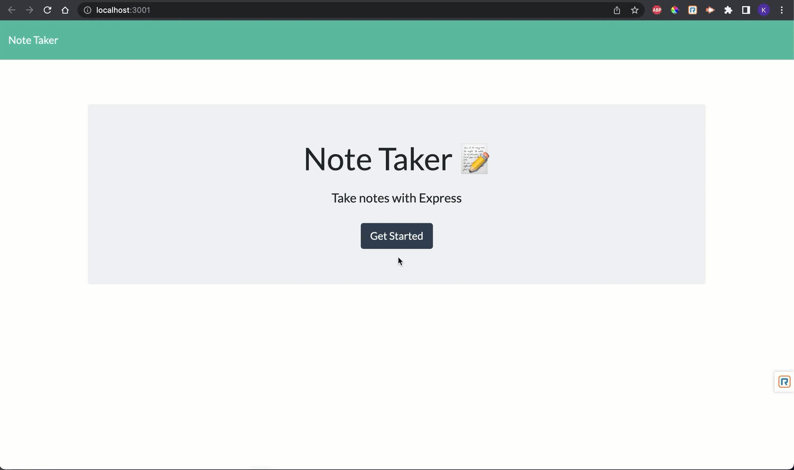

# Welcome to note-taker 👋
[](https://www.npmjs.com/package/note-taker)
[](https://img.shields.io/badge/License-MIT-yellow.svg)

> AS A small business owner 
> I WANT to be able to write and save notes
> SO THAT I can organize my thoughts and keep track of tasks I need to complete

### ✨ Demo 

## Install

```sh
npm install
```

## Run tests

```sh
npm run test
```

## Author

👤 **me**


## Show your support

Give a ⭐️ if this project helped you!


## 📝 License

This project is [MIT](https://img.shields.io/badge/License-MIT-yellow.svg) licensed.

***
_This README was generated with ❤️ by [readme-md-generator](https://github.com/kefranabg/readme-md-generator)_